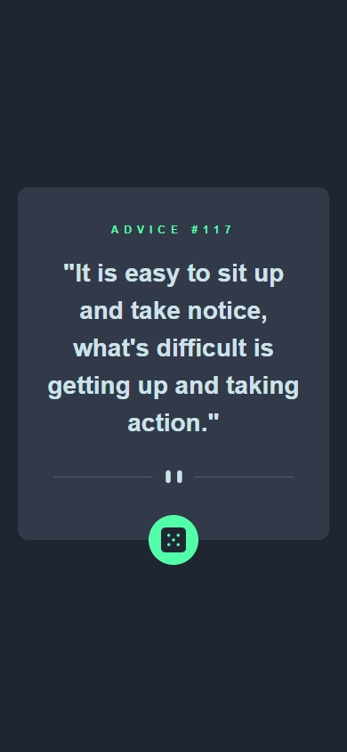
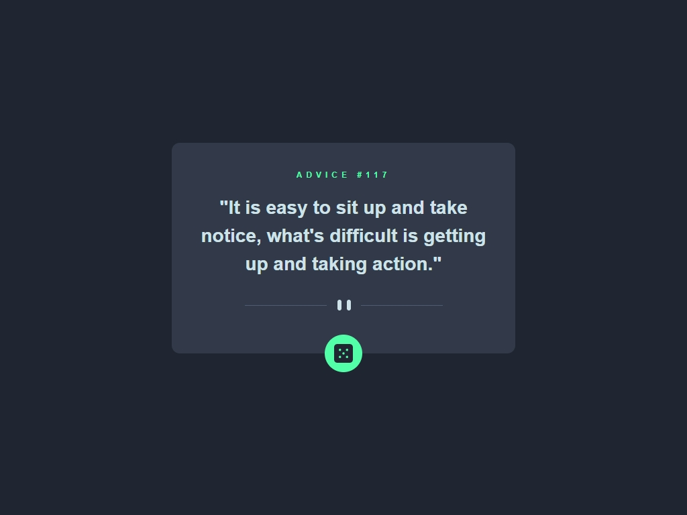
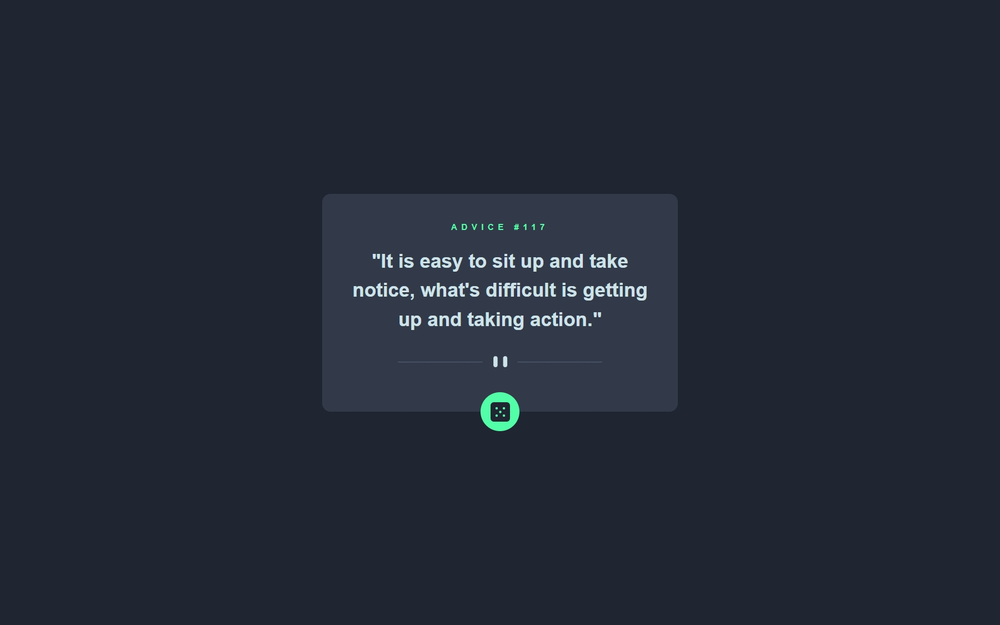

# Frontend Mentor - Advice generator app solution

This is a solution to the [Advice generator app challenge on Frontend Mentor](https://www.frontendmentor.io/challenges/advice-generator-app-QdUG-13db). Frontend Mentor challenges help you improve your coding skills by building realistic projects.

## Table of contents

- [Overview](#overview)
  - [The challenge](#the-challenge)
  - [Screenshot](#screenshot)
  - [Links](#links)
- [My process](#my-process)
  - [Built with](#built-with)
  - [What I learned](#what-i-learned)
- [Author](#author)

## Overview

### The challenge

Users should be able to:

- View the optimal layout for the app depending on their device's screen size
- See hover states for all interactive elements on the page
- Generate a new piece of advice by clicking the dice icon

### Screenshot

- Mobile

- Tablet

- Laptop

### Links

- Solution URL: [https://github.com/lalvarezweb/advice-generator](https://github.com/lalvarezweb/advice-generator)
- Live Site URL: [https://lalvarezweb-advice-generator.netlify.app/src/](https://lalvarezweb-advice-generator.netlify.app/src/)

## My process

# Built with

- Semantic HTML5 markup
- CSS custom properties
- Tailwind CSS
- CSS Flex
- Mobile-first workflow
- Vanilla Javascript ES6

## What I learned

During the development of this project, I had the opportunity to work with **HTML5**, **CSS3**, **Tailwind CSS**, and **JavaScript ES6**. The main objective was to replicate a design challenge provided by Frontend Mentor and connect it to an external API to generate random tips.

Throughout this project, I gained valuable knowledge and skills, and I would like to highlight a few key learnings:

# Tailwind CSS

This project was my first experience using Tailwind CSS, and it has been a game-changer in terms of speeding up my development workflow. I learned how to leverage Tailwind's utility classes to quickly style and structure the user interface. By using its pre-built components and responsive design features, I was able to achieve a polished and professional-looking design more efficiently than before. I appreciate the flexibility and modularity of Tailwind CSS, which allowed me to customize the styles to match the design requirements precisely.

# API Integration

One of the significant aspects of this project was connecting to an external API to retrieve random tips. This experience taught me a lot about making API requests using JavaScript. I learned how to use `fetch()` to send HTTP requests, handle the responses, and extract the required data. I also improved my understanding of asynchronous programming and the importance of error handling when working with external APIs. Integrating the API added dynamic content to the project and made it more interactive for the users.

# Improved Referencing of APIs

Throughout the development process, I realized the significance of clear and concise references to APIs. I learned to document and organize the API documentation effectively, making it easier for myself and others to understand how to interact with the API endpoints. This practice helped me maintain consistency and prevented unnecessary errors. By improving my referencing skills, I enhanced the overall quality of the project and made it easier for future developers to work with the codebase.

In conclusion, this project provided me with valuable experience in using **HTML5**, **CSS3**, **Tailwind CSS**, and **JavaScript ES6**. I learned a great deal about Tailwind CSS, gained hands-on experience in integrating external APIs, and improved my skills in referencing and working with APIs. These learnings have enhanced my capabilities as a front-end developer and will undoubtedly benefit me in future projects.

## Author

- LinkedIn - [lalvarezweb](https://www.linkedin.com/in/lalvarezweb/)
- Frontend Mentor - [@itlucdev](https://www.frontendmentor.io/profile/ITLUCDEV)
- Discord - [@lalvarezweb#1583]

**Note: Delete this note and add/remove/edit lines above based on what links you'd like to share.**

